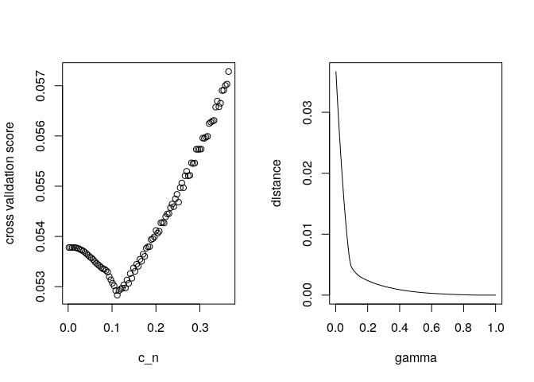

Estimation of a Two-component Mixture Model with Applications to
Multiple Testing.
================
Patra, R. K.

In this article, we discuss the computation of the confidence lower
bound (see Section 4) and estimator (see Section 3) developed in Patra
and Sen (2016). We also discuss the appropriate choice for the tuning
parameter involved.

To download the R package use the following in R:

``` r
library(devtools)
```

    ## Loading required package: usethis

``` r
devtools::install_github(repo = "rohitpatra/mixmodel")
```

    ## Downloading GitHub repo rohitpatra/mixmodel@master

    ## Error in utils::download.file(url, path, method = method, quiet = quiet,  : 
    ##   cannot open URL 'https://api.github.com/repos/rohitpatra/mixmodel/tarball/master'

``` r
library(mixmodel)
```

We first generate an i.i.d sample of size \(n= 5000\) from \[
F = \alpha_0 * \text{Beta}(1,10) + (1- \alpha_0 ) \text{Unif}(0,1),
\] where \(\alpha_0 =.1.\)

``` r
data.gen<- function( n, alpha){
    ind<- rbinom(n, 1, alpha)
    data<- ind* rbeta(n, 1,5) + (1-ind)* runif(n,0,1)
    return(data)
}
data.1<- data.gen(n = 500, alpha = .1)
```

For all computation in the above mixture model, we will use the R
function named *mix.model*. Different values for the variable *method*
lead to computation of different quantities.

### Lower confidence bound for \(\alpha_0\)

The following code computes the \(95\%\) confidence lower bound for
\(\alpha_0\)

``` r
est.lwr.bnd <- mix.model(data.1, method = "lwr.bnd", gridsize = 600)
print(est.lwr.bnd)
```

    ## Call:mix.model(data = data.1, method = "lwr.bnd", gridsize = 600)

    ## [1] "The  '95%' lower confidence for alp_0 is  0.0133333333333333"

``` r
plot(est.lwr.bnd)
```

<!-- -->

### Estimation of \(\alpha_0\)

#### Pre-specified choice of \(c_n\)

The following code computes an estimate of \(\alpha_0\) using the
default choice of the tuning parameter, i.e.,
\(c_n = 0.1 \log(\log(n))\)

``` r
est.default <- mix.model(data.1, method = "fixed", gridsize = 600)
```

    ## Warning in mix.model(data.1, method = "fixed", gridsize = 600): 'c.n' is
    ## not given. Fixing it to be '0.1*log(log(n))

``` r
print(est.default)
```

    ## Call:mix.model(data = data.1, method = "fixed", gridsize = 600)
    ## [1] "Estimate of alp is 0.0766666666666667"
    ## [1] " The chosen value c_n is 0.182690266560073"

``` r
plot(est.default)
```

<!-- -->

The follwoing code gives an estimator of \(\alpha_0\) when \(c_n\) is
chosen to be \(0.05 \log\log(n)\)

``` r
est.fixed <- mix.model(data.1, method = "fixed", c.n = .05*log(log(length(data.1))), gridsize = 600)
print(est.fixed)
plot(est.fixed)
```

#### Cross validated choice of \(c_n\)

We can use the same function as above to compute the estimate of
\(\alpha_0\) when \(c_n\) is chosen via cross-validation. The only
difference being we have set *method* to be *cv*.

``` r
est.cv <- mix.model(data.1, method = "cv", gridsize = 600)
```

    ## Warning in cv.mix.model(data, folds = folds, reps = reps, cn.s = cn.s,
    ## cn.length = cn.length, : Make sure that data is transformed such that F_b
    ## is Uniform(0,1)

    ## [1] "Expected time for completion"
    ## Time difference of 1.687224 secs

``` r
print(est.cv)
```

    ## Call:mix.model(data = data.1, method = "cv", gridsize = 600)
    ## [1] "Estimate of alp is 0.0933333333333333"
    ## [1] " The chosen value c_n is 0.111994669470009"

<!-- -->

``` r
plot(est.cv)
```

<!-- -->

## References

<div id="refs" class="references">

<div id="ref-ps16">

Patra, Rohit Kumar, and Bodhisattva Sen. 2016. “Estimation of a
Two-Component Mixture Model with Applications to Multiple Testing.” *J.
R. Stat. Soc. Ser. B. Stat. Methodol.* 78 (4): 869–93.
<https://doi.org/10.1111/rssb.12148>.

</div>

</div>
